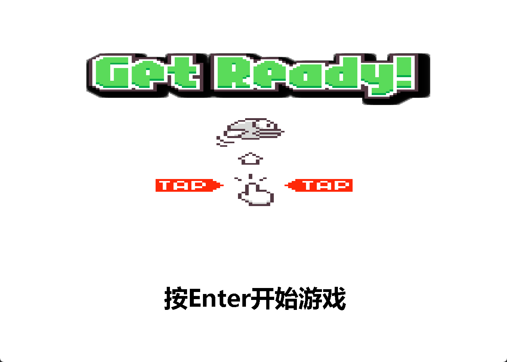
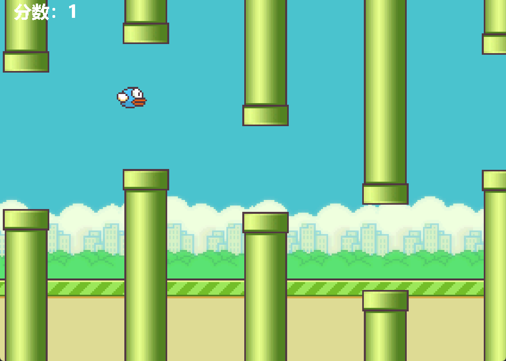
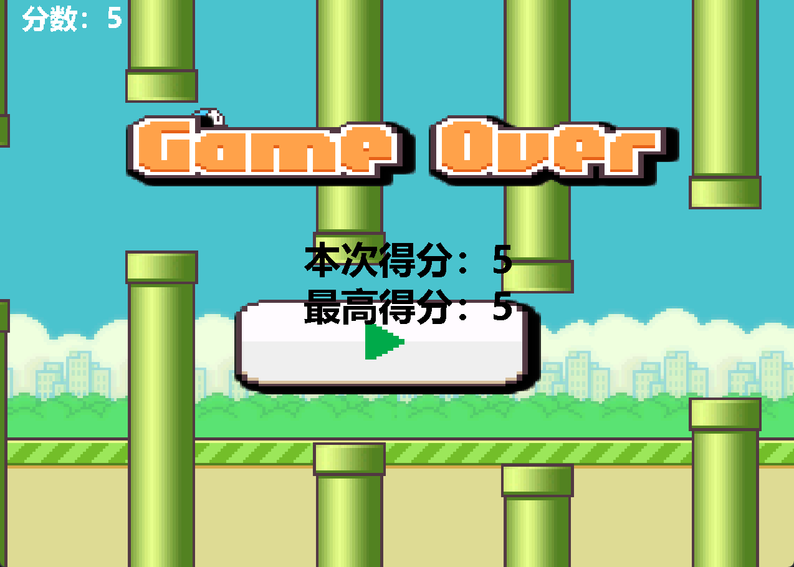

# **Java版笨鸟先飞**

## **项目介绍**
本项目是用 Java 实现的经典小游戏“笨鸟先飞”（Flappy Bird）桌面版。玩家通过键盘操作控制小鸟飞行，躲避不断出现的水管障碍物，挑战更高分数。项目采用面向对象设计，包含对象池、资源管理、碰撞检测等常用游戏开发技术。

## 主要功能
- **键盘操作**：`Enter` 开始/重开游戏，`Space` 控制小鸟飞行。
- **分数统计**：实时显示当前分数和最高分。
- **障碍物生成**：障碍物高度随机，难度适中（暂未实现动态难度功能）。
- **碰撞检测**：小鸟与障碍物碰撞即游戏结束。
- **资源管理**：图片资源打包在 jar 内可正常加载。
- **对象池优化**：障碍物对象复用，提升性能。

## 主要技术点
- Java AWT 图形界面编程
- 双缓冲绘图防止闪烁
- 对象池模式管理障碍物
- 资源通过类加载器读取，兼容 jar 包
- 面向对象结构清晰，易于扩展

## 项目结构
src/

├── com.bird.app/ 启动类 

├── com.bird.main/ 游戏主逻辑、实体类 

├── com.bird.util/ 工具类与常量 

└── img/ 图片资源

## 运行方式
您可以直接在本项目的[Release页面](https://github.com/IAA-bot/FlappyBird/releases/tag/v1.0.1)下载编译好的 jar 包运行，或者自行编译源码运行：
1. 使用 IDEA 或命令行编译项目。
2. 运行 `com.bird.app.GameApp` 主类。

## 适用环境
- 本项目仅在JDK 21下开发测试通过，如果您的JDK版本过低可能无法顺利运行。
- 跨平台支持 Windows、macOS、Linux

## 预览截图

---

如需了解详细实现，请阅读源代码注释。
